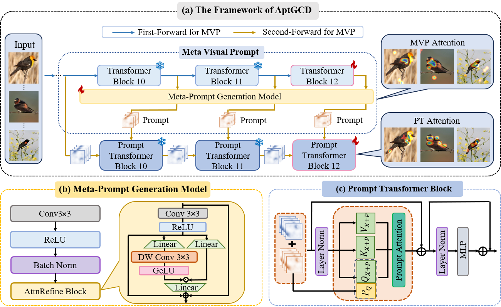

# Prompt Transformer for Generalized Category Discovery
This repository is the official implementation of AptGCD: [Less Attention is more: Prompt Transformer for Generalized Category Discovery](https://openaccess.thecvf.com/content/CVPR2025/papers/Zhang_Less_Attention_is_More_Prompt_Transformer_for_Generalized_Category_Discovery_CVPR_2025_paper.pdf)

# Requirements
The code was tested on python3.10 pytorch2.0.0 and CUDA11.7.
We recommend using conda environment to setup all required dependencies:
```
conda env create -f environment.yml
conda activate AptGCD
```
If you have any problem with the above command, you can also install them by <code>pip install -r requirements.txt<\code>.

# Datasets
We trained on three general datasets [CIFAR-10](https://docs.pytorch.org/vision/main/generated/torchvision.datasets.CIFAR10.html), [CIFAR-100](https://docs.pytorch.org/vision/main/generated/torchvision.datasets.CIFAR100.html)