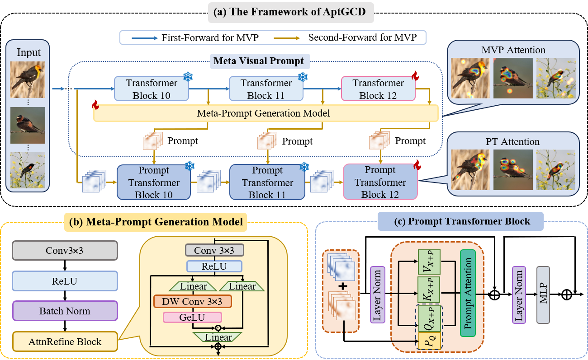

# Less Attention is More: Prompt Transformer for Generalized Category Discovery (CVPR2025)

<p align="center">
    <a href="https://openaccess.thecvf.com/content/CVPR2025/html/Zhang_Less_Attention_is_More_Prompt_Transformer_for_Generalized_Category_Discovery_CVPR_2025_paper.html"></a>
  <a href="https://github.com/CVMI-Lab/SlotCon/blob/master/LICENSE"></a>
</p>
<p align="center">
	Less Attention is more: Prompt Transformer for Generalized Category Discovery (CVPR 2025)<br>
  By
  Wei Zhang, 
  Baopeng Zhang*, 
  Zhu Teng,
  Wenxin Luo, 
  Junnan Zou,
  Jianping Fan
</p>
 


## 🏃 Running
### Dependencies
The code was trained on ```python3.10``` ```pytorch2.0.0``` and ```CUDA11.7```.
You can install dependencies by 
```
pip install -r requirements.txt
```

### Config
Set paths to datasets and desired log directories in ```config.py```.

### Datasets
* We trained on three generic datasets: [CIFAR-10](https://docs.pytorch.org/vision/main/generated/torchvision.datasets.CIFAR10.html), [CIFAR-100](https://docs.pytorch.org/vision/main/generated/torchvision.datasets.CIFAR100.html), [ImageNet-100](https://docs.pytorch.org/vision/main/generated/torchvision.datasets.ImageNet.html#torchvision.datasets.ImageNet).
* We also user four fine-grained benchmarks: [StanfordCars](https://github.com/sgvaze/osr_closed_set_all_you_need#ssb), [CUB-200](https://github.com/sgvaze/osr_closed_set_all_you_need#ssb), [FGVC-Aircraft](https://github.com/sgvaze/osr_closed_set_all_you_need#ssb) and [Herbarium19](https://www.kaggle.com/c/herbarium-2019-fgvc6).

### Scripts
Train the model (taking the Stanford Cars benchmark as an example).
```
bash scripts/run_cars.sh
```

### Pretrain model
Download the [pretrain models](https://drive.google.com/drive/folders/1T6dAzWCsjMoc7VEspLjFTvrvhPeDNNMx) and put them in ```pretrain_model``` folder. Changing the path (such as ```/pretrain_model/scars.pt```) in ```train.py``` if you use these models.

## 💡 Citing this work
If you find this repo useful for your research, please consider citing our paper:
```
@inproceedings{zhang2025less,
  title={Less Attention is More: Prompt Transformer for Generalized Category Discovery},
  author={Zhang, Wei and Zhang, Baopeng and Teng, Zhu and Luo, Wenxin and Zou, Junnan and Fan, Jianping},
  booktitle={Proceedings of the Computer Vision and Pattern Recognition Conference},
  pages={30322--30331},
  year={2025}
}
```

## 💜 Acknowledge
The code is largely built on : [LegoGCD](https://github.com/Cliffia123/LegoGCD) and [SPTNet](https://visual-ai.github.io/sptnet/). Many thanks to their briliant works.